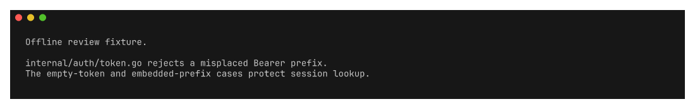

# ask




`ask` sends a prompt and optional standard input to a local agent harness.

It supports Claude and Codex, typed JSON output, reusable configuration, and
interactive provider selection. `wrappers.txt` defines its short command names.

Generate shell completions with `ask completion bash`, `zsh`, `fish`, or `nu`.

## Development

```bash
nix develop
go test -race ./...
nix flake check
./hack/screenshots.sh
```
