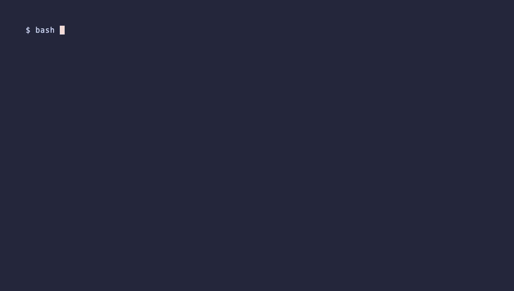

# antigravity

Replay an offline token parser review with antigravity.

The demo replays an offline response fixture. It does not contact a model or claim a new agent run.

## Install

```sh
brew install roshbhatia/tap/ask-provider-antigravity
nix profile add 'github:roshbhatia/ask#provider-antigravity'
```

Install the core utility separately, or select its all-provider bundle. Runtime tools still need their own credentials.

This adapter calls `agy`. Install and authenticate that CLI before use. The Nix package includes its runtime. Run `ask provider validate` to check the installation.

## Demo



[Tape source](demo.tape) · [Task script](demo.sh)

Run `nix develop -c bash extras/antigravity/demo.sh` to run the task without recording.
Run `nix develop -c python3 hack/extra-demos.py antigravity` to record it.
